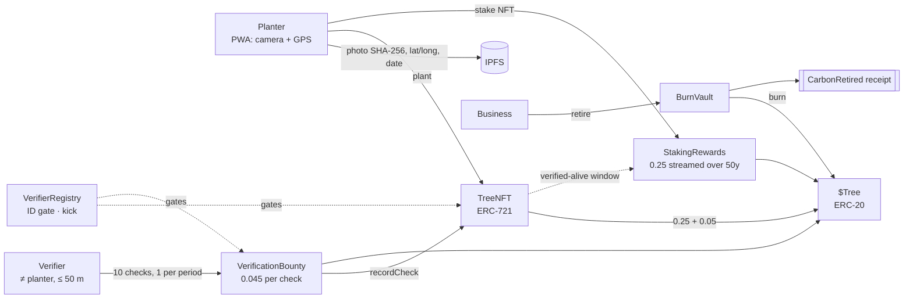

# 🌳 TreeChain — `$Tree`

**A verification chain, not a blockchain — built on Monad.**

Plant a tree → mint a **TreeNFT** (photo + GPS + date) → earn **$Tree** → businesses buy and **burn** $Tree for an on-chain carbon offset, backed by a **50-year peer-verification chain**.

Built solo for the [Monad Metropolis Hackathon](https://hackathon.monad.xyz). Everything runs on **Monad Testnet** (chain `10143`).

| | |
|---|---|
| Live app | _see [`DEPLOYED.md`](DEPLOYED.md)_ |
| Contracts | 6 Solidity contracts · [`src/`](src) · 81 Foundry tests · [`test/`](test) |
| App | React + Vite PWA · wagmi/viem · camera + GPS + Web Crypto · [`frontend/`](frontend) |
| License | MIT |

---

## The problem

Tree-planting carbon credits have a trust problem: the same forest gets sold twice, photos get recycled, and nobody checks whether a tree is still alive in year five. Buyers can't audit what they're buying.

## The idea

Every tree is an on-chain record you can audit from a coordinate and a photo hash, and it only earns its full value if peers keep confirming it's alive for 50 years.



### One token, exactly 1.00 `$Tree` per tree

| Slice | Amount | When |
|---|---|---|
| Planter upfront | **0.25** | on plant (with the NFT) |
| Planter staking | **0.25** | stake the TreeNFT; streams linearly over 50 years **while the tree is verified-alive** |
| Team | **0.05** | on plant |
| Verifiers | **0.45** | 0.045 × 10 peer checks, one per period (5 years) |
| **Total** | **1.00** | = 1 tonne CO₂ over the tree's 50-year life |

There is **no pre-mine and no admin mint**. Supply only exists when trees do: the three emitting contracts are each hard-capped per tree, and the deploy script renounces `$Tree`'s admin role so the minter set is frozen forever. The only thing that destroys supply is `BurnVault`.

### Anti-fraud, enforced by the contracts (not the UI)

| Rule | Where | How |
|---|---|---|
| **15 m minimum between any two trees** | `TreeNFT.plant` | Fixed-point **haversine** (`GeoLib`) against a spatial grid: only the 3×3 neighbouring 44 m cells are scanned, so cost stays flat as the forest grows. Handles the antimeridian and cell edges. |
| **Verifier ≠ planter** | `VerificationBounty.verify` | Different **wallet and ID**: `VerifierRegistry` binds one ID hash to one wallet, so one person can't hold two IDs of the same hash. A self-check reverts and pays 0. |
| **Verifier must be on site** | `VerificationBounty.verify` | Submitted coordinates must be within **50 m** of the tree (same haversine). |
| **A photo can be used once** | `TreeNFT` | Planting and verification photo hashes share one namespace — no recycling. |
| **10-check cap** | `TreeNFT.recordCheck` | At most 10 checks per tree, so verifiers can never draw more than 0.45. A check can't happen before its period. |
| **Same verifier can't check twice in a row** | `VerificationBounty` | Forces different eyes on a tree. |
| **Failed "still alive" check** | `TreeNFT` + `StakingRewards` | Chain ends; stake stream freezes at the last *passed* check (max exposure: one period of stream = 0.025 $Tree). |
| **ID gate · cheaters kicked** | `VerifierRegistry` | Kicked wallets can't plant, verify or claim. |
| **Placement prompt** | PWA | Public land or a home front yard that can last 50 years. |

### Why Monad

Planting and verifying happen in the field, on phones, by people who've never used a chain. **Sub-second finality** means the "Tree planted" screen confirms before they put the phone away, and **low gas** keeps a 0.045 $Tree verification reward worth claiming. Full EVM equivalence meant standard Solidity, Foundry, and wagmi/viem — Trust Wallet works out of the box.

---

## Repo layout

```
src/                 Solidity (TreeToken, TreeNFT, VerifierRegistry, StakingRewards,
                     VerificationBounty, BurnVault, GeoLib, Params)
test/                Foundry tests: unit, fuzz, invariants, full 50-year lifecycle
script/Deploy.s.sol  one-shot deploy + wiring (also writes the app's address file)
frontend/            React + Vite PWA, Vercel config, /api/pin IPFS route
  src/generated/     ABIs + bytecode + deployment.json (generated; committed so Vercel needs no Foundry)
e2e/                 Real-browser tests (Chromium + fake camera + mocked GPS) against local anvil
scripts/             export-abi.mjs · write-deployed.mjs
LICENSE              MIT
DEPLOYED.md          addresses + explorer links
GO-LIVE.md           step-by-step runbook: deploy → Vercel → demo → submit
SUBMISSION.md        portal text, video scripts, checklist
```

## Quick start

### Contracts

```bash
git clone --recurse-submodules <repo> && cd treechain
forge test                      # 81 tests, ~10 s
FOUNDRY_INVARIANT_RUNS=256 FOUNDRY_INVARIANT_DEPTH=500 forge test   # deep invariant soak
```

### Deploy to Monad Testnet — two ways

**A. From the wallet, no key export (recommended).** Run the app (below), open `/#/deploy`, connect Trust Wallet on Monad Testnet and press *Deploy all*. 12 normal wallet popups deploy and wire everything; the page then shows `deployment.json` to commit (or to paste into the `VITE_DEPLOYMENT_JSON` Vercel env var).

**B. Foundry.**

```bash
cast wallet import treechain-burner --interactive      # key lives in an encrypted keystore, not .env
CHECK_PERIOD_SECONDS=300 forge script script/Deploy.s.sol \
  --rpc-url monad_testnet --account treechain-burner --broadcast
node scripts/write-deployed.mjs                        # regenerates DEPLOYED.md from the deployment file
```

`CHECK_PERIOD_SECONDS` is the **verification period**. Production is `157788000` (5 years). The testnet deployment uses a compressed **demo clock** (e.g. `300` = 5 minutes, so a tree's whole 50-year chain is 50 minutes) so the full lifecycle can be shown live. The app displays a banner whenever the period is compressed.

### App

```bash
cd frontend && npm install
npm run dev                  # http://localhost:5173  (camera/GPS/crypto need https or localhost)
npm run build                # typecheck + production build (PWA)
npm run test:api             # unit-tests the /api/pin IPFS route against a stubbed Pinata
```

Environment (all optional — see [`frontend/.env.example`](frontend/.env.example)): `PINATA_JWT` (server-side IPFS pinning), `VITE_WC_PROJECT_ID` (WalletConnect), `VITE_DEPLOYMENT_JSON`.

**Without `PINATA_JWT`** the app still works end to end: the TreeNFT's metadata (photo hash, coordinates, date) is stored on-chain as a `data:` URI and the UI says so. Add the key to get real IPFS pinning of the photo.

### Vercel

Import the repo, set **Root Directory** to `frontend`, add `PINATA_JWT` (and optionally the others), deploy. `vercel.json` already sets the SPA rewrite, camera/geolocation permissions policy and the `/api/pin` function.

## Testing

| Layer | What | Command |
|---|---|---|
| Geo math | haversine vs float64 reference values (≤ 2 mm), fuzz symmetry/monotonicity, antimeridian, far-point short-circuit | `forge test --match-contract GeoLibTest` |
| Plant | 15 m boundary (14.9 m ✗ / 15.1 m ✓), grid-cell & date-line edges, duplicate photos, kicked/unregistered | `forge test --match-contract PlantTest` |
| Verify | self-verify reverts, 50 m radius, 10-check cap = exactly 0.45, due-time gating, photo reuse, dead reports | `forge test --match-contract VerifyTest` |
| Staking | linear stream, pause without verification, retroactive unlock, freeze on dead report, kicked stakers, 0.25 hard cap | `forge test --match-contract StakingTest` |
| Lifecycle | one tree through 50 years mints **exactly** 1.00 $Tree (0.25 / 0.25 / 0.05 / 0.45) | `forge test --match-contract LifecycleTest` |
| Invariants | stateful fuzzing: supply ≤ 1.00 × trees, team share exact, verifier pay bounded, no two trees < 15 m | `forge test --match-contract InvariantTest` |
| API | `/api/pin`: hash mismatch rejected, JWT stays server-side, validation | `npm run test:api` |
| **Browser E2E** | real Chromium + fake camera + mocked GPS + EIP-6963 "Trust Wallet" → register, plant, 15 m block, stake, second-wallet verify, claim, burn; and the `/deploy` page | `e2e/run.sh` · `e2e/run.sh deploy` |

## Known limitations (honest list)

- **Testnet ID is self-asserted.** `VerifierRegistry.register` takes a hash; one hash ↔ one wallet, but one human can still make two wallets with two handles. Mainnet needs proof-of-personhood (the rest of the system only calls `isActive`/`idOf`, so it's a drop-in).
- **GPS is self-reported.** On-chain checks make fraud *expensive and detectable* (15 m rule, unique photos, peer checks, 50 m radius), not impossible. The roadmap adds a media-provenance attestation (C2PA) and verifier staking/slashing.
- **A malicious verifier can falsely report a tree dead.** They still earn the check fee. Mitigation on testnet is an admin `reinstate`; mainnet adds a second-verifier confirmation and slashing.
- **Streamed rewards can't be clawed back.** If a tree dies during an unverified window, at most one period of stream (0.025 $Tree) has already been paid.
- **Compressed testnet clock.** The 5-year period is shortened on testnet purely so the lifecycle is demoable.
- **The `/api/pin` route is public.** Anyone can pin through your Pinata quota; use a Pinata key restricted to pinning and add rate limiting before mainnet.
- **Not audited.** Hackathon code.

## Roadmap

C2PA/hardware-attested photos · verifier staking + slashing + dispute round · proof-of-personhood IDs · $Tree/USDC liquidity so businesses can buy on-chain · registry integrations (Verra/Gold Standard methodologies) · mobile-native shell.

## Positioning (indicative, from the project brief)

1 tree = 1 tCO₂ over 50 years = 1 $Tree. Reference market ranges used in the pitch: ARR credits $15–45 · blue carbon $30–75 · REDD+ $4–15 · ICVCM-labelled $15–30 · EU ETS comparison $80–100+. These are indicative figures for context, not a forecast of $Tree's price or financial advice — check current sources before relying on them.

## License

MIT © 2026 Casey Blanche
